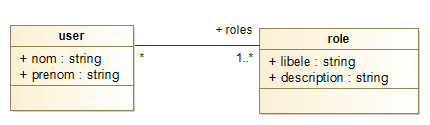
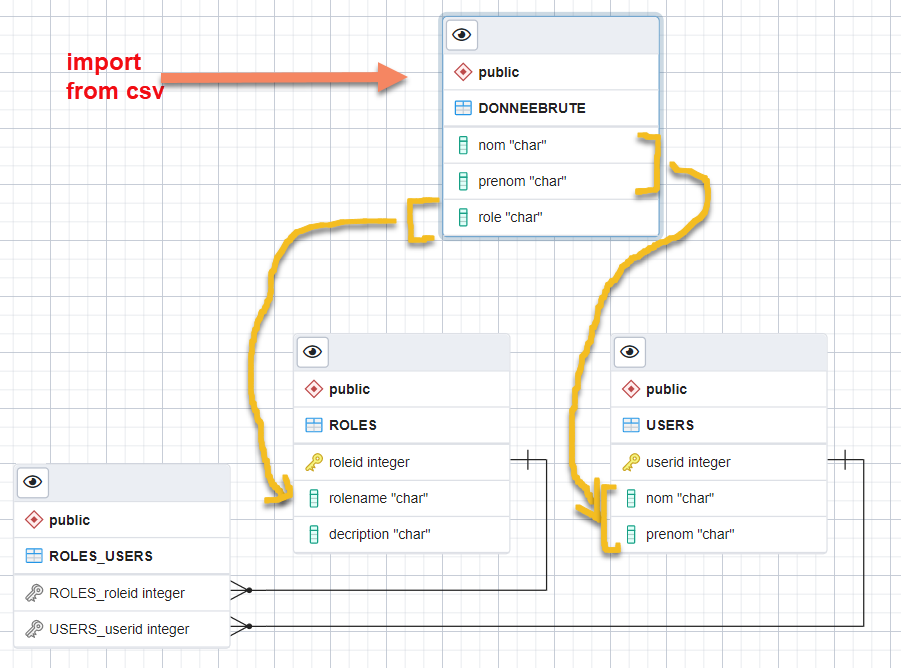

# exemple_sql
Remplir et initialiser une BD depuis un ensemble de documents non structuré (un csv)

# modèle

# Diagramme Entité-relation 

# Les données brutes format csv

# Les scripts postgress

# TODO Les scripts Mysql 