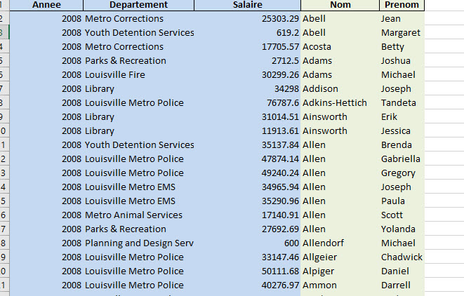
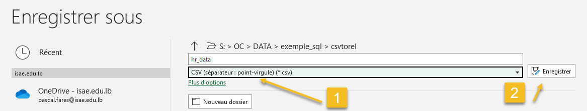

# Étapes pour passer d'un modèle plat CSV vers du relationnel normalisé (avec Mysql)

## 1. Sauver au format CSV

## 2. Importer le fichier Brut dans Mysql

## 3. Définir les modèles  conceptuel (UML) et physique (ERD)

## 4. Créer les tables qui ne dépendent d'aucune autre

## 5. Créer les tables avec dépendance pour resigner la clé étrangères