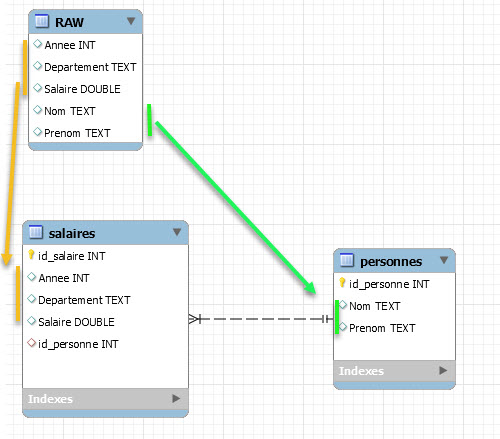

# Étapes pour passer d'un modèle plat CSV vers du relationnel normalisé (avec Mysql)

## 1. Sauver au format CSV


## 2. Importer le fichier Brut dans Mysql

<video width="640" height="480" controls>
  <source src="videos/import_csv_mysql.mp4" type="video/mp4">
Your browser does not support the video tag.
</video>

## 3. Définir les modèles  conceptuel (UML) et physique (ERD)

<video width="640" height="480" controls>
  <source src="videos/le_modele.mp4" type="video/mp4">
Your browser does not support the video tag. 
</video>

## 4. Créer les tables qui ne dépendent d'aucune autre

### La table personnes
<video width="640" height="480" controls>
  <source src="videos/create_personnes.mp4" type="video/mp4">
Your browser does not support the video tag. 
</video>

La requête en SQL (MySQL 8)
```sql
create table  personnes
     (id_personnes INT not null AUTO_INCREMENT, PRIMARY KEY (id_personnes))
     (select distinct `Nom`, `Prenom` from RAW);
```
## 5. Créer les tables avec dépendance pour renseigner la clé étrangère

<video width="640" height="480" controls>
  <source src="videos/create_salaires.mp4" type="video/mp4">
Your browser does not support the video tag. 
</video>

la requête en SQL (MySQL 8)
```sql
create table  salaires
     (id_salaire INT not null AUTO_INCREMENT, PRIMARY KEY (id_salaire))
     (SELECT 
        R.Annee, R.Departement, R.Salaire, P.id_personnes 
      FROM
	    RAW R INNER JOIN personnes P 
        ON 
          R.Nom = P.Nom and R.Prenom = P.Prenom
	  );
```